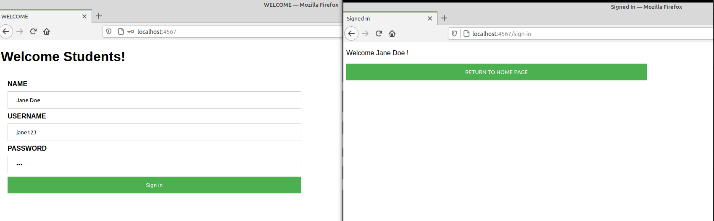
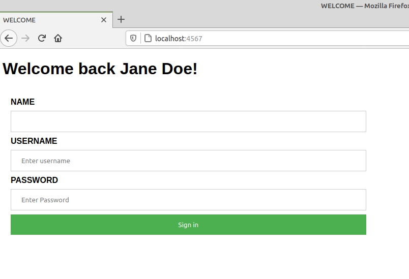

# THIRD SPARK PROJECT

This page is displayed in your browser after you type in http://localhost:4567



For this project, I am using
- Maven Build Tool
- IDE: Visual Studio Code 
- The Java Spark micro-framework


## What is Maven?
Maven is a build tool. It automates everything related to building and organizing a project, it uses a pom.xml file to manage 
dependencies (third party libraries your project depends on). When using a libary that isn't part of the Java Standard Library, you
need more than an "import" statement at the top of your java file. You have to either download the jar file or add it as a dependency 
to your pom.xml file (if you are using maven build tool). 

## What is Spark?
Spark is a Micro-framework that allows you to spin up a web server. Do not confuse the "Spark" framework with the database "Apache Spark".
They just happen to share the same name.<br />
<b>Documentation<b>: http://sparkjava.com/ <br />

# How to use this project
Inside the my_app directory (containing pom.xml file), run the following commands:
```
$ mvn compile
$ mvn exec:java 
``` 
NOTE: $ mvn exec:java -Dexec.mainClass="com.leehaney.App" would work too.<br />
In the browser, type in 
```
http://localhost:4567 
```
The page should appear.
